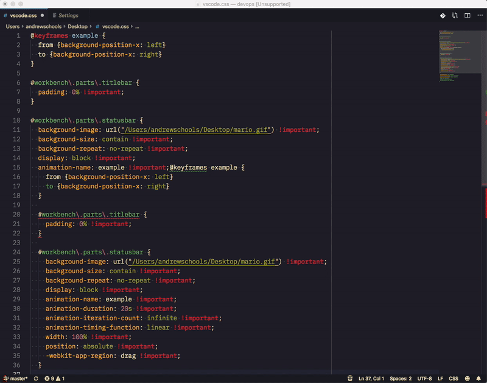

# vscode-mario
Let Mario run across the full length of your status bar while you're programming.

Better example on Youtube: https://youtu.be/cmXhmkCxBr4

## Instructions

- Download an animated image of Mario.  You can pick whatever image you want (even if it isn't Mario), but I used this one: https://u.cubeupload.com/THENEWGAMECREATOR/stillgoing.gif.  
- Install the VSCode extension: Custom CSS and JS Loader.  Their github page is here: https://github.com/be5invis/vscode-custom-css.
- Take the stylesheet located in this repository and save it somewhere to your computer. Make sure you update the image URL to point to your animated image. 
- Follow the Custom CSS and JS Loader extension instructions on how to point to your custom stylesheet.  
- Now restart VSCode.

That should be it.
